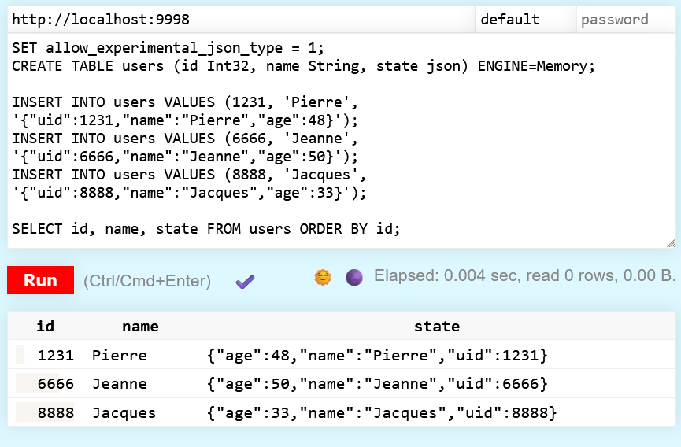

# 🦆🏠 Du*ch*DB Server

This project is a Go-based web server that integrates with both [chDB-go](https://github.com/chdb-io/chdb-go) and [duckdb](https://github.com/duckdb/duckdb), providing a web interface for executing database queries, and an API to interact with the databases programmatically. It embeds the static file `play.html` directly within the binary for easy distribution and deployment.



## Features

- **Query Execution**: Allows users to execute queries against a CHDB database or a DuckDB database.
- **Session Management**: Persists the database connection across multiple queries.
- **Static Content**: Serves a static HTML file (`play.html`) embedded within the executable.

## Prerequisites

Before you start, ensure you have the following installed:
- Go 1.22 or higher
- libchdb

```bash
curl -sL https://lib.chdb.io | bash
```

## 🚀 Install

1. Go Install

```bash
go install github.com/loicalleyne/duchdb-server@latest
$GOPATH/bin/duchdb-server
```

2. Build from source

```bash
git clone https://github.com/loicalleyne/duchdb-server.git
make build
./chdb-server
```
### Session Path
You can configure the server by setting the following environment variables before running the server:

- DATA_PATH: Specifies the directory path for CHDB session data. Defaults to .chdb_data if not set.
- DUCK_PATH: Specifies the directory path for CHDB session data. Defaults to .duckdb_data/duck.db if not set.

## 💡 Usage


Open your browser and navigate to `http://localhost:9998` to start querying chdb and `http://localhost:9999` to query duckdb.

#### Create a new database

```sql
SET allow_experimental_json_type = 1;
CREATE TABLE users (id Int32, name String, state json) ENGINE=Memory;

INSERT INTO users VALUES (1231, 'Pierre', '{"uid":1231,"name":"Pierre","age":48}');
INSERT INTO users VALUES (6666, 'Jeanne', '{"uid":6666,"name":"Jeanne","age":50}');
INSERT INTO users VALUES (8888, 'Jacques', '{"uid":8888,"name":"Jacques","age":33}');

SELECT id, name, state FROM users ORDER BY id;
```

#### Query remote parquet data

```sql
SELECT RegionID, SUM(AdvEngineID), COUNT(*) AS c, AVG(ResolutionWidth), COUNT(DISTINCT UserID)
                        FROM url('https://datasets.clickhouse.com/hits_compatible/athena_partitioned/hits_0.parquet') GROUP BY RegionID ORDER BY c DESC LIMIT 10
```

## 💫 Show your support

Give a ⭐️ if this project helped you!
